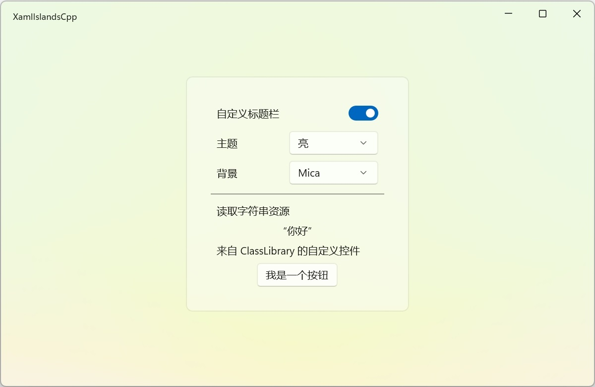

# Xaml-Islands-Cpp

 [XAML Islands](https://docs.microsoft.com/en-us/windows/apps/desktop/modernize/xaml-islands) (C++/WinRT) 应用示例。

**实现的功能**

* WinUI 集成
* 自定义标题栏
* 明暗主题切换
* 背景切换
* 支持打包为 MSIX
* 支持 x64 和 ARM64 架构
* 支持 XAML 热重载

## 编译要求

1. Windows SDK 22621
2. Visual Studio 2022，需安装 C++ 和 UWP 负载

## 运行要求

Windows 10 v1903+ 或 Windows 11
